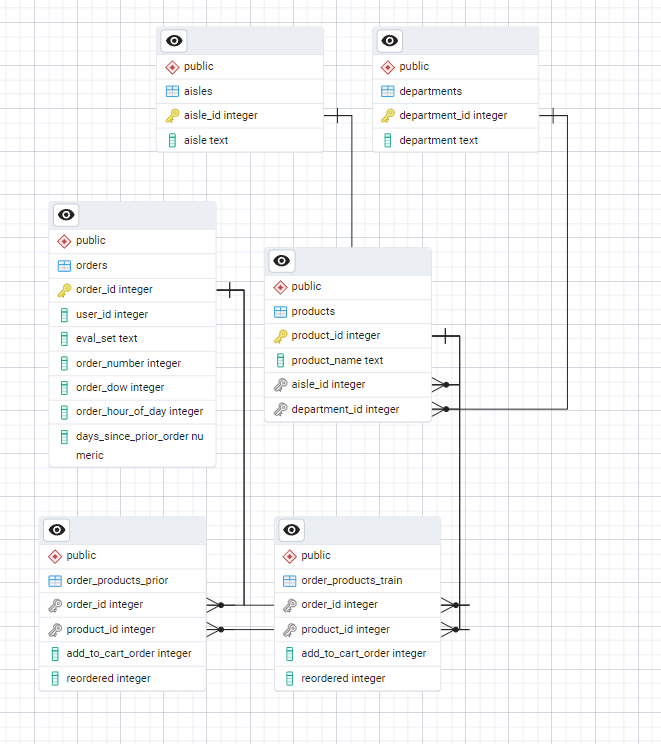

# 🛒 Instacart Data Insights  

## 📌 Компания  
**Instacart** — крупнейший онлайн-супермаркет в США, доставляющий продукты и товары первой необходимости.  

Я работаю аналитиком в команде **Customer & Product Analytics**.  
Моя задача — изучать поведение покупателей, находить тренды и помогать бизнесу принимать решения на основе данных.  

---

## 📊 О проекте  
Этот проект посвящён **аналитике пользовательских заказов** в Instacart.  
Мы исследуем:  
- Какие продукты и категории покупают чаще всего?  
- В какие дни и часы активность покупателей максимальна?  
- Какие товары заказывают вместе?  
- Как часто пользователи делают повторные заказы?  

---

## 🖼️ Визуализация  


---

## ⚙️ Как запустить проект  

### 1. Установить PostgreSQL и создать базу  
    sql
    CREATE DATABASE instacart_db;
### 2. Импортировать таблицы (в порядке)
   #### 📦 Датасет
Полный датасет слишком большой для хранения на GitHub.  
Вы можете скачать его отсюда:  
[Instacart Market Basket Analysis (Kaggle)](https://www.kaggle.com/datasets/psparks/instacart-market-basket-analysis)
   
   #### После скачивания поместите файлы в папку `dataset/`   
   - aisles
   - departments
   - products
   - orders
   - order_products_prior
   - order_products_train

### 3. Запустить Python-скрипт для анализа
 #### 1. Создать и активировать окружение:
    python -m venv venv
    venv\Scripts\activate 
 #### 2.Установить зависимости:
    pip install -r requirements.txt

 #### 3.Запустить скрипт:
    python main.py
    
---

### 🛠 Инструменты и ресурсы
 - PostgreSQL 17 — хранение и обработка данных
 - Python: pandas, psycopg2, matplotlib, plotly — анализ и визуализации
 - Apache Superset — интерактивные дашборды
 - Power BI — отчёты и бизнес-аналитика
 - pgAdmin — схема базы данных (ERD)
 - Dataset: Instacart Market Basket Analysis

---

### 📂 Структура репозитория
```
├── images/              # скриншоты аналитики
├── output/              # сохраненные результаты (csv, графики)
├── queries.sql          # SQL-запросы
├── main.py              # Python-скрипт для подключения к БД
├── analytics.py         # аналитика + визуализации + экспорт
├── config.py            # конфигурация подключения к БД
├── requirements.txt     # список Python-зависимостей
├── README.md            # описание проекта
├── charts/              # папка для графиков
├── exports/             # папка для Excel

```
